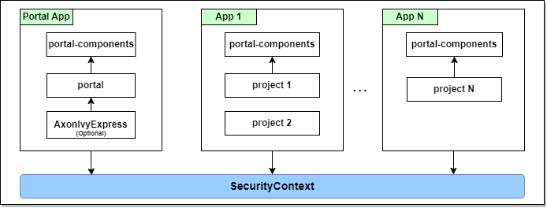

## **Axon Ivy Express in the Portal**

The Portal and Projects using it should be deployed in different
applications but in the same security context.

The Portal App consists of the following modules: **portal-components**,
**portal** and **AxonIvyExpress**. While **AxonIvyExpress** is optional, all other
modules are mandatory.

## **portal-components**

**Contains a set of public UI components**

This module contains Ivy components such as User Selection, Role
Selection, Document Table, Process Chain, Process History, and Process
Viewer,... These components are independent of the modules portal and
AxonIvyExpress. You can use them in your own applications.

## **portal**

**Contains portal specific UI components, templates and pages**

The module **portal** provides a set of specific UI components that you
need to use and administer (or manage) the portal, templates for
developer and portal pages.

The templates offer features like top menu, application menu and user
menu. It also contains start process links to default pages like Portal
home, Portal task list, Portal case list etc..

## **AxonIvyExpress**

**No Code Process Management**

This tool set allows end users to create their own processes and manage
them easily. It gives users more flexibility when working with the
Portal.

This project has been extended from portal. It allows the end user to

-   Create his own workflow
-   Create and modify a web form for this workflow

Express also provides an AdHoc process feature. When Express is
deployed, users can start an AdHoc process from any task. Adhoc allows
users to define additional process steps which will be executed before
the current task.